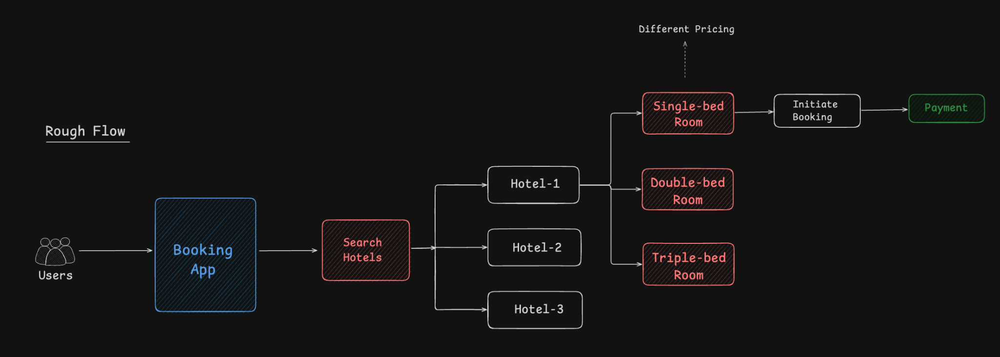
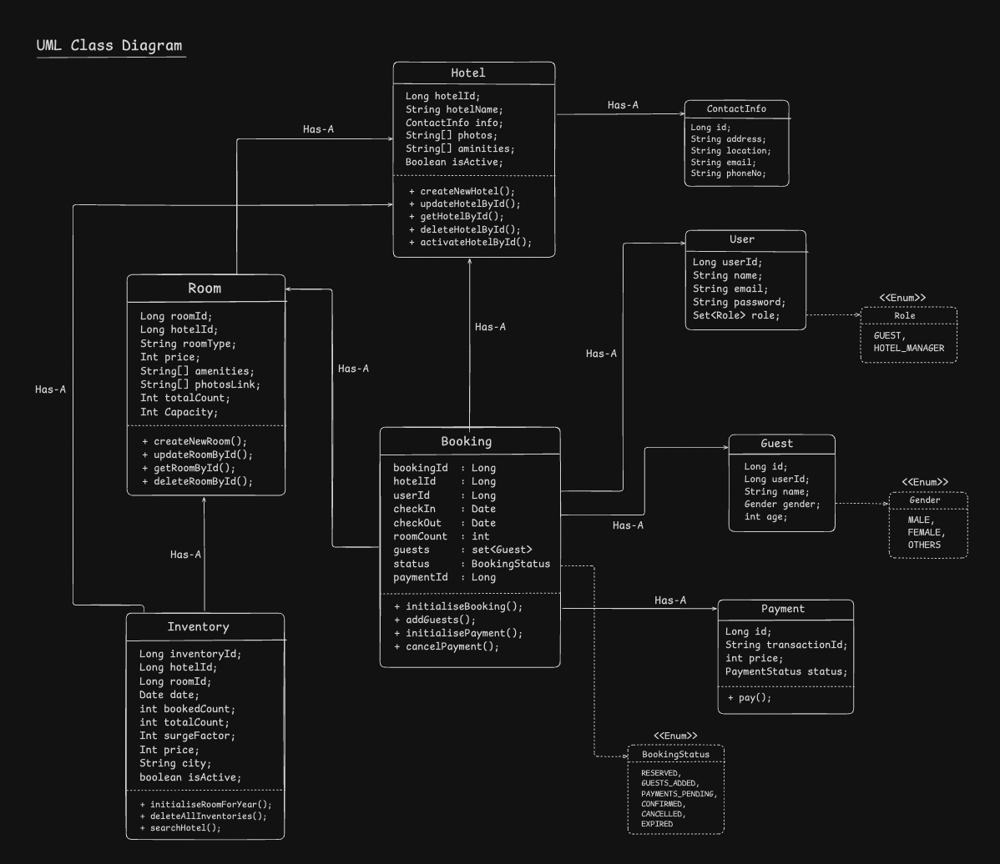
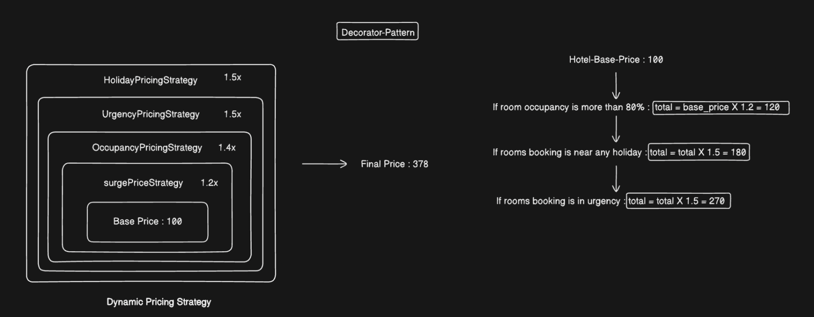
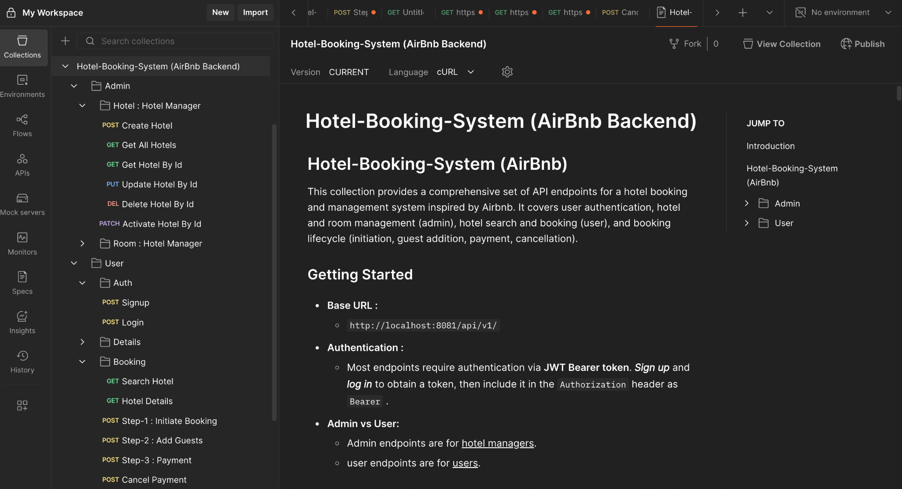
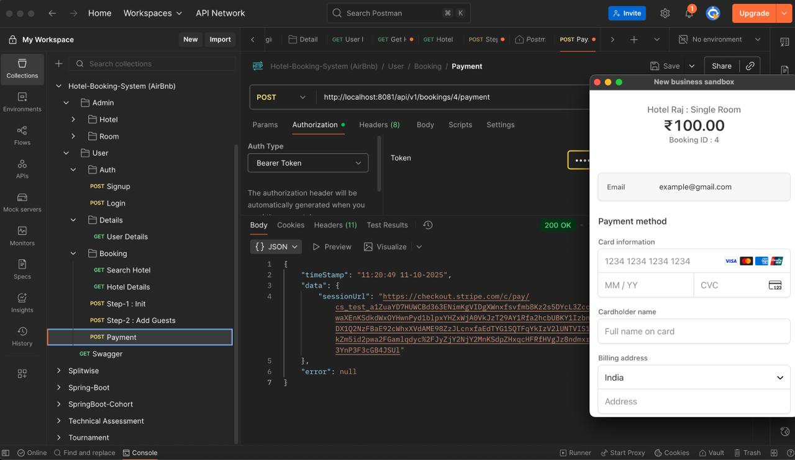

# 📌 BookNStay — Hotel Booking & Management System

A production-ready Spring Boot backend for a hotel booking / management platform

[//]: # (Project Demo : [Video-Link]&#40;https://github.com/rahul-mahato29&#41; &#40;Uploading Soon...&#41;)

[//]: # ()
[//]: # (Technical Documentation : [Document-Link]&#40;https://github.com/rahul-mahato29&#41; &#40;Updating Soon...&#41;)

## 🚀 Application Flow

## 💡 UML Class Diagram

## 💳 Pricing Strategy

## 🧭 API Documentation (Postman Collection)
👉 You can view or import the complete API documentation here:  [**Postman Collection**](https://documenter.getpostman.com/view/32039601/2sB3QNqU4G)

## 🙋‍♂️ Author
**Rahul Mahato - Adaptive Engineer**

[LinkedIn](https://www.linkedin.com/in/rahul-mahato-74129b1b5/) | mahatorahul.work@gmail.com